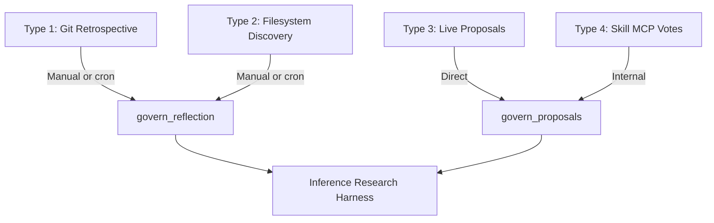

# PASS-28: 0xRay RPC Surface — Exact Tools Exposed + Inference Pipeline Reality

**Date:** 2026-06-15  
**Question Answered:** Which inference types are actually exposed via 0xRay RPC, and how do we pipeline them?

---

## 1. The Actual 0xRay Governance RPC Tools (from governance.server.ts)

These are the **only** tools currently registered on the Governance MCP server:

### Tool 1: `govern_proposals` (Primary / Most Important)

**Description (verbatim):**
> "Run one or more proposals through the full 0xRay governance system. Internal deliberation via 3 skill MCPs + required Dynamo Solar SSOT filter. Returns merged structured decisions."

**Input Schema:**
```json
{
  "proposals": [{
    "id": "string (optional)",
    "type": "fix | refactor | guard | automate | codify | strategic | compliance",
    "title": "string (required)",
    "description": "string (required)",
    "evidence": ["string"],
    "source": "string",
    "confidence": "number"
  }],
  "context": { "project": "...", "phase": "..." },
  "options": {
    "require_external": { "type": "boolean", "default": true }
  }
}
```

**What it actually does:**
- Runs the three internal skill MCPs (`code-review`, `security-audit`, `researcher`)
- Calls Dynamo (via `governWithSolar` / `InferenceGovernanceIntegration`)
- Merges via `governance-core.js` PHI/TAU matrix
- Returns final verdicts + full traces

**Inference Types Covered:** **Type 3 (Live) + Type 4 (Skill Votes)**

---

### Tool 2: `govern_reflection`

**Description (verbatim):**
> "Parse a reflection (or reflection file) and run its extracted proposals through the full governance system. This is the primary way to govern outcomes from reflection-based workflows."

**Input Schema:**
```json
{
  "reflectionPath": "string (optional)",
  "reflectionContent": "string (optional)",
  "context": {}
}
```

**What it actually does:**
- Reads a `.md` reflection file (or raw content)
- Parses it for proposals
- Feeds those proposals into the same `govern_proposals` pipeline

**Inference Types Covered:** **Type 1 (Retrospective) + Type 2 (Filesystem Discovery)**

This is the **bridge tool** that brings historical/reflection-based inference into governance.

---

### Tool 3: `get_active_codex`

Read-only tool that returns the current Codex SSOT (term count, version, raw data optional).

---

## 2. What Is *Not* Exposed as RPC

The following are **internal utilities**, not MCP tools:

- `captureSessionInference(fromRef, toRef)` — Git-based retrospective extraction
- `SessionCapture.findReflections()` / `findLogs()` / `findReports()`
- Raw `governWithSolar()` client calls (these are called *internally* by the governance service)

These must be called directly in code or wrapped before being exposed.

---

## 3. How to Pipeline the Four Inference Types via 0xRay RPC

### Recommended Pipeline (Production-Grade)



### Concrete Strategy

| Inference Type | How to Get It Into Governance | Recommended Harness Capture Point |
|----------------|-------------------------------|-----------------------------------|
| **Type 1 + 2** | Use `govern_reflection` (reflectionPath or reflectionContent) | Wrap `govern_reflection` handler |
| **Type 3 + 4** | Use `govern_proposals` (primary path) | Wrap `govern_proposals` handler or `GovernanceService.govern()` |
| **Raw Session Capture** | Not exposed — call `captureSessionInference()` directly in harness code | Call before/after governance for pattern enrichment |

---

## 4. Answer to the Original Question

**Which do we need?**

We need **all four**, but with different priorities:

- **Primary (must have):** Type 3 + Type 4 via `govern_proposals` — this is where real-time governed decisions happen.
- **Secondary (high value):** Type 1 + Type 2 via `govern_reflection` — this brings retrospective learning and reflection outcomes into the governed system.
- **Tertiary (enrichment):** Raw `captureSessionInference()` for long-term pattern mining.

**How do we pipeline them?**

- Use `govern_proposals` as the main RPC surface for live work.
- Use `govern_reflection` as the dedicated bridge for retrospective/reflection-based inference.
- The Inference Research Harness should wrap **both** of these tools (or the underlying `GovernanceService`) so every governed decision is logged with full context.

**Are they all exposed via 0xRay RPC?**

**No.** Only two of the four inference types have first-class RPC tools:
- `govern_proposals` → Type 3 + 4
- `govern_reflection` → Type 1 + 2

The raw git-based session capture functions are internal and must be called directly.

---

**End of PASS-28**