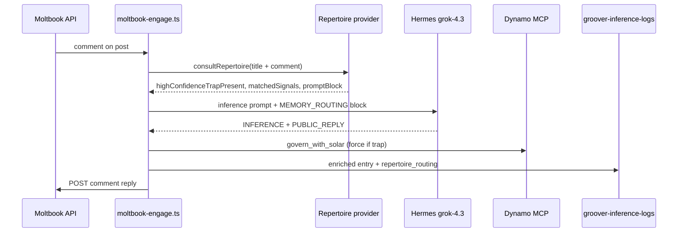

# PASS-30: Moltbook ↔ Repertoire Cross-System Integration

**Date:** 2026-06-18  
**Question Answered:** How does live Moltbook engagement consult Repertoire memory before generating governed replies?

**Prerequisite status:** PASS-29 closed the internal loop (ingest → promote → route → TaskHandler feedback). PASS-30 is the first integration across system boundaries.

---

## 1. Executive Finding

Moltbook engagement scripts now **consult Repertoire before Hermes inference** on every reply path (own-post and other-post). The consultation uses the same contract as `repertoire__get_task_confidence` MCP — loaded in-process from `@0xray/repertoire` for co-located deploy scripts.

| Layer | Before PASS-30 | After PASS-30 |
|-------|----------------|---------------|
| Moltbook engage | Dynamo + local `curated_signals.json` matcher only | **+ Repertoire `getTaskConfidence`** |
| Inference prompt | `v2-negative-space-closure` only | **+ `MEMORY_ROUTING` block** when trap present |
| Governance force | `TYPE: ontological-trap` text only | **+ `highConfidenceTrapPresent`** from registry |
| JSONL logs | `matched_primitives` envelope | **+ `repertoire_routing` snapshot** |

This is the first time **production Groover inference on Moltbook** is influenced by **production Repertoire memory** (349 ingested entries, 8 validated primitives, live feedback stats).

---

## 2. Architecture



### Transport choice

| Option | Used? | Rationale |
|--------|-------|-----------|
| MCP stdio (`repertoire__get_task_confidence`) | Hermes host | Documented in `hermes-mcp.example.json` for agent sessions |
| In-process provider import | **Moltbook deploy scripts** | Same machine, same contract, no stdio spawn overhead |
| HTTP | No | Repertoire has no Railway HTTP surface yet |

Both paths call `createMemoryRoutingProvider()` → `getTaskConfidence()`.

---

## 3. Implementation

### New module: `deploy/repertoire-confidence.ts`

| Export | Purpose |
|--------|---------|
| `consultRepertoire(description)` | Load provider, return confidence + `promptBlock` |
| `shouldForceGovernanceWithRepertoire(inference, ctx)` | Force Dynamo when trap in text **or** Repertoire trap flag |
| `toRepertoireLogFields(ctx)` | Serialize routing snapshot for JSONL |

**Path resolution:**

```
REPERTOIRE_ROOT = env REPERTOIRE_ROOT ?? ../../repertoire (from deploy/)
Provider: dist/provider/memory-routing-provider.js
Data: data/curated_signals.json (335+ observations per validated primitive)
```

Graceful degradation: if provider unavailable, logs `[Repertoire] unavailable` and proceeds without memory block.

### Modified scripts

| File | Change |
|------|--------|
| `deploy/moltbook-engage.ts` | Consult before `generateReplyWithInference`; inject prompt block; log routing |
| `deploy/moltbook-other-engage.ts` | Same pattern for feed engagement |
| `deploy/governance-helper.ts` | `repertoire_routing?` field on `InferenceLogEntry` |

### MEMORY_ROUTING prompt block (when consulted)

```
MEMORY_ROUTING (Repertoire — consult before inference):
- highConfidenceTrapPresent: true|false
- recommendedAgent: architect|none
- matchedSignals: attestation-as-map, ...
- avgConfidence: 0.989
```

When `highConfidenceTrapPresent: true`, additional closure guidance is appended.

---

## 4. Production Context (from PASS-29)

Evidence the integration is memory-backed, not fixture-fed:

| Metric | Value |
|--------|-------|
| Ingested Groover lines | 349 |
| Validated primitives | 8 |
| `attestation-as-map` observations | 335 |
| `attestation-as-map` avg confidence | 0.9909 (post-feedback) |
| Live TaskHandler session | PASS — `npm run live-feedback-session` |
| Feedback outcomes on trap signals | 2+ |

Pre-orchestration query for trap-shaped text returns:

- `highConfidenceTrapPresent: true`
- `recommendedAgent: architect`
- 8 matched signals

---

## 5. JSONL Envelope Extension

`buildInferenceLogEntry` now accepts optional `repertoireRouting`:

```json
{
  "repertoire_routing": {
    "consulted": true,
    "providerAvailable": true,
    "highConfidenceTrapPresent": true,
    "recommendedAgent": "architect",
    "matchedSignals": ["attestation-as-map", "..."],
    "avgConfidence": 0.989,
    "complexityBoost": 25
  }
}
```

**Ingest note:** Repertoire strict ingest still keys on `matched_primitives` + `match_confidence` from post-inference primitive matching. `repertoire_routing` is observability metadata — does not bypass enriched gate.

---

## 6. Open Items (Not Blockers)

### 6.1 recommendedAgent vs actual assignment — RESOLVED (2026-06-18)

**Was:** Live TaskHandler assigned `orchestrator` while `recommendedAgent: architect` because trap `complexityBoost` exceeded architect `maxComplexity: 50`.

**Fix:** `RepertoireOrchestratorBridge.resolveTrapCapableAgent()` — high-confidence trap tasks route to `recommendedAgent` without complexity-threshold exclusion. Test: `RepertoireOrchestratorBridge.test.ts`.

**Verified:** `npm run live-feedback-session` → `• architect: 1 tasks`, MCP `analyze_proposal` on architect server. Integrity guard in live script fails if mismatch recurs.

### 6.2 Hermes MCP wiring

`hermes-mcp.example.json` documents stdio Repertoire for Hermes-hosted sessions. Moltbook deploy scripts use in-process import. Align paths when eX0 bundle ships.

### 6.3 Feedback log path when cwd = xray

TaskHandler feedback JSONL lands in `xray/logs/orchestrator-feedback/` when 0xRay cwd is xray root. Registry updates still hit `repertoire/data/`. Unify via `feedbackDir` config in a future Repertoire release.

### 6.4 Live engage validation

PASS-30 wires the consultation path. First production engage run with `MOLTBOOK_API_KEY` will produce JSONL lines with `repertoire_routing.consulted: true` — operational proof pending next heartbeat/engage cron.

---

## 7. Verification

### Unit tests

```bash
cd groover-integration-work
npx vitest run deploy/repertoire-confidence.test.ts
npx vitest run deploy/governance-helper.test.ts
```

### Manual smoke (no Moltbook API)

```bash
cd groover-integration-work
npx tsx -e "
import { consultRepertoire } from './deploy/repertoire-confidence.ts';
const r = await consultRepertoire('TYPE: ontological-trap attestation-as-map');
console.log(r);
"
```

Expected: `consulted: true`, `highConfidenceTrapPresent: true`, non-empty `promptBlock`.

### Production engage

```bash
MOLTBOOK_API_KEY=... npx tsx deploy/moltbook-engage.ts
```

Look for log line: `[Repertoire] trap=true agent=architect signals=8 avg=0.989`

---

## 8. Relation to Prior Passes

| Pass | Connection |
|------|------------|
| PASS-10/19 | Harness design → Repertoire implementation |
| PASS-28 | `govern_reflection` bridge; Moltbook JSONL as reflection substrate |
| PASS-29 | Closed internal loop; prerequisites for PASS-30 |
| **PASS-30** | **First cross-system wire: Moltbook → Repertoire** |

---

## 9. Recommended Next Steps

1. **Run live engage** — confirm `[Repertoire]` log lines and `repertoire_routing` in new JSONL.
2. **Re-ingest** — new enriched lines with routing metadata into Repertoire (`npm run ingest` in repertoire).
3. **PASS-31 (proposed):** Trap routing tuning — `recommendedAgent` matches TaskHandler assignment.
4. **eX0 bundle:** Single `hermes-mcp.json` with Repertoire paths for Hermes + deploy script env parity.

---

## 10. Canonical Paths

| Artifact | Path |
|----------|------|
| Repertoire consult helper | `groover-integration-work/deploy/repertoire-confidence.ts` |
| Own-post engage | `groover-integration-work/deploy/moltbook-engage.ts` |
| Other-post engage | `groover-integration-work/deploy/moltbook-other-engage.ts` |
| Hermes MCP example | `repertoire/hermes-mcp.example.json` |
| Live TaskHandler report | `repertoire/logs/live-taskhandler-session.json` |
| PASS-29 | `brain-dumps/PASS-29-MOLTBOOK-LIVE-AND-REPERTOIRE-ADAPTIVE-LOOP.md` |

---

## 11. Answer to the Original Question

**How does Moltbook consult Repertoire?**

Before every governed reply, engage scripts call `consultRepertoire()` with post title + comment/post content. Repertoire returns trap-aware confidence from production `curated_signals.json`. High-confidence traps inject a `MEMORY_ROUTING` block into the Hermes prompt and force Dynamo governance even before `TYPE:` classification is parsed from inference output.

**Is this the first cross-system integration?**

Yes. Prior work closed loops within Repertoire and within 0xRay TaskHandler. PASS-30 connects the **public Moltbook bot** to the **private memory registry** for the first time.

---

**End of PASS-30**